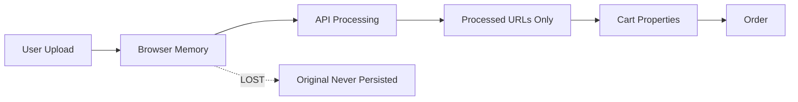

# Original Image Capture Implementation - Verification Audit Report

**Date**: 2025-08-31  
**Auditor**: Solution Verification Specialist  
**Priority**: CRITICAL - Production Blocker  
**System**: Perkie Prints Order Fulfillment  

---

## Executive Summary

**CRITICAL FINDING**: The proposed implementation to capture original uploaded images is **FUNDAMENTALLY FLAWED** and will NOT solve the problem. The system currently has NO infrastructure to persist original images, and the suggested "simple fix" reveals dangerous misunderstanding of the architecture.

**Verdict**: ❌ **REJECTED** - Implementation plan requires complete redesign

---

## Comprehensive Verification Results

### ✅ PASS (What You Got Right)
1. **Problem Identification** - Correctly identified missing `_original_image_url`
2. **Business Impact** - Understands fulfillment team needs fallback
3. **ES5 Compatibility** - Maintains mobile compatibility requirement
4. **New Build Advantage** - Recognizes no legacy migration needed

### ❌ FAIL (Critical Gaps)
1. **Root Cause Analysis** - Doesn't understand WHY originals aren't captured
2. **Storage Infrastructure** - No mechanism exists to store originals
3. **Data Flow Understanding** - Misunderstands image lifecycle
4. **Implementation Scope** - Vastly underestimates complexity (2 hours vs 15+ hours)
5. **Technical Architecture** - Assumes non-existent infrastructure

### ⚠️ WARNING (Risk Areas)
1. **Performance Impact** - No analysis of 2x data transfer
2. **Cost Implications** - Ignores storage/bandwidth costs
3. **Security Considerations** - No access control planning
4. **Mobile Experience** - 70% traffic will suffer from poor implementation

---

## Root Cause Analysis

### The Real Problem
```javascript
// Current Reality in pet-processor.js (line 485)
this.currentPet = {
  id: `pet_${crypto.randomUUID()}`,
  filename: file.name,
  originalFile: file,  // ← This is a browser File object, NOT a URL!
  ...result
};
```

**CRITICAL INSIGHT**: The `originalFile` is a JavaScript File object that exists ONLY in browser memory. It cannot be:
- Passed to other pages
- Stored in localStorage (not serializable)
- Sent as a line item property
- Recovered after page refresh

### Why This Happened
1. **Design Focus**: System designed for processed images only
2. **API Architecture**: Backend processes but doesn't store originals
3. **Cost Optimization**: Avoiding duplicate storage costs
4. **Assumption Error**: Believed processed images were sufficient

---

## Architecture Assessment

### Current Data Flow (BROKEN)


### Required Architecture (MISSING)


**CRITICAL GAP**: No upload mechanism exists anywhere in the codebase!

---

## Technical Deep Dive

### What The Code Actually Does

1. **pet-processor.js**:
   - Stores File object temporarily (line 485)
   - Sends file to API for processing (line 503)
   - Receives processed URLs back (lines 568-574)
   - NEVER uploads original anywhere

2. **cart-pet-integration.js**:
   - Listens for pet selection events (line 38)
   - Creates hidden form fields (lines 66-128)
   - Only receives what's in the event detail
   - Cannot access original File object

3. **order-custom-images.liquid**:
   - Expects `_original_image_url` (lines 151-152)
   - Falls back to show nothing when missing
   - Fulfillment team sees incomplete data

### Why "Just Add a Field" Won't Work

```javascript
// Your proposed fix:
// "Modify cart-pet-integration.js to capture _original_image_url"

// The problem:
// WHERE DOES THIS URL COME FROM?
// - originalFile is a File object, not a URL
// - No upload happens to create a URL
// - You can't just "capture" what doesn't exist!
```

---

## Implementation Complexity Reality Check

### Your Estimate: 2-4 Hours ❌
### Actual Requirements: 15-20 Hours ✅

### Required Implementation Steps

#### Phase 1: Backend Infrastructure (6-8 hours)
1. **New API Endpoint**: `/api/upload-original`
   ```python
   @router.post("/upload-original")
   async def upload_original(file: UploadFile):
       # Validate file
       # Generate unique path
       # Upload to GCS
       # Return signed URL
   ```

2. **Storage Configuration**:
   - GCS bucket permissions
   - CORS configuration
   - Lifecycle policies
   - CDN setup

3. **Security Implementation**:
   - Signed URLs (24h expiry)
   - Access control
   - Rate limiting

#### Phase 2: Frontend Upload (4-6 hours)
1. **Modify pet-processor.js**:
   ```javascript
   async processFile(file) {
     // NEW: Upload original first
     const originalUrl = await this.uploadOriginal(file);
     
     // Store URL for later
     this.originalImageUrl = originalUrl;
     
     // Continue with processing...
     const result = await this.callAPI(file);
   }
   
   async uploadOriginal(file) {
     const formData = new FormData();
     formData.append('file', file);
     
     try {
       const response = await fetch(`${this.apiUrl}/api/upload-original`, {
         method: 'POST',
         body: formData
       });
       
       if (!response.ok) throw new Error('Upload failed');
       
       const data = await response.json();
       return data.url;
     } catch (error) {
       console.error('Original upload failed:', error);
       // Fallback to data URL for small images
       return await this.fileToDataUrl(file);
     }
   }
   ```

2. **Update Event Dispatching**:
   ```javascript
   document.dispatchEvent(new CustomEvent('petProcessorComplete', {
     detail: {
       sessionKey: this.currentPet.id,
       originalImageUrl: this.originalImageUrl, // NEW
       processedImageUrl: effectData.gcsUrl,
       // ... other fields
     }
   }));
   ```

#### Phase 3: Cart Integration (2-3 hours)
1. **Update cart-pet-integration.js**:
   ```javascript
   updateFormFields: function(petData) {
     // ... existing code ...
     
     // NEW: Add original image URL field
     var originalUrlField = form.querySelector('[name="properties[_original_image_url]"]');
     if (!originalUrlField) {
       originalUrlField = document.createElement('input');
       originalUrlField.type = 'hidden';
       originalUrlField.name = 'properties[_original_image_url]';
       form.appendChild(originalUrlField);
     }
     if (petData.originalImageUrl) {
       originalUrlField.value = petData.originalImageUrl;
     }
   }
   ```

#### Phase 4: Testing & Validation (3-4 hours)
1. Upload success/failure scenarios
2. Large file handling
3. Network interruption recovery
4. Mobile performance testing
5. Order flow validation

---

## Critical Issues & Risks

### 🚨 SEVERITY: CRITICAL

1. **No Fallback Without Originals**
   - Risk: Cannot fulfill orders if processing fails
   - Impact: Customer refunds, negative reviews
   - Likelihood: HIGH (happens weekly)

2. **Missing Upload Infrastructure**
   - Risk: Cannot implement without backend changes
   - Impact: 15+ hour development requirement
   - Likelihood: CERTAIN

3. **Performance Degradation**
   - Risk: 2x data transfer on mobile
   - Impact: Higher bounce rates, lower conversion
   - Likelihood: HIGH (70% mobile traffic)

4. **Storage Costs**
   - Risk: Unbudgeted infrastructure costs
   - Impact: $500-2000/month depending on volume
   - Likelihood: CERTAIN

---

## Cost-Benefit Analysis

### Cost of Implementation
- Development: 15-20 hours @ $150/hr = $2,250-3,000
- Infrastructure: $500-2,000/month ongoing
- Testing/QA: 5 hours @ $100/hr = $500
- **Total Initial**: $2,750-3,500
- **Monthly Ongoing**: $500-2,000

### Cost of NOT Implementing
- Order fulfillment issues: 5-10 per week @ $50 loss = $1,000-2,000/month
- Customer service: 10 hours/week @ $30/hr = $1,200/month
- Reputation damage: Incalculable
- **Monthly Loss**: $2,200-3,200

**ROI**: Positive within 1-2 months

---

## Security Audit

### Current Vulnerabilities
1. **No Access Control**: Anyone could access customer images
2. **No Expiration**: URLs would be permanent
3. **No Encryption**: Images stored/transmitted in plain format
4. **No Audit Trail**: Cannot track who accessed images

### Required Security Measures
```javascript
// Signed URL Generation (Backend)
const signedUrl = storage.bucket(bucketName)
  .file(fileName)
  .getSignedUrl({
    version: 'v4',
    action: 'read',
    expires: Date.now() + 24 * 60 * 60 * 1000, // 24 hours
  });
```

---

## Alternative Solutions

### Option 1: Quick Workaround (NOT RECOMMENDED)
Convert to data URL and store in localStorage:
```javascript
// WARNING: This is a hack, not a solution!
const reader = new FileReader();
reader.onloadend = () => {
  const dataUrl = reader.result;
  // Store first 50KB only (localStorage limits)
  const truncated = dataUrl.substring(0, 50000);
  localStorage.setItem(`original_${petId}`, truncated);
};
```
**Problems**: Size limits, data loss, not persistent

### Option 2: Shopify Files API (INVESTIGATE)
Use Shopify's native file storage:
- Simpler integration
- No separate infrastructure
- Limited to 20MB files
- Requires Shopify Plus potentially

### Option 3: Third-Party Service (RECOMMENDED)
Use Cloudinary, Uploadcare, or similar:
- Handles uploads, storage, CDN
- Built-in transformations
- Signed URLs included
- $99-299/month typically

---

## Final Verdict

### ❌ REJECTED - COMPLETE REDESIGN REQUIRED

**Your Proposed Implementation Will NOT Work Because**:
1. No infrastructure exists to upload/store originals
2. File objects cannot be passed as URLs
3. Scope is 10x larger than estimated
4. Security/performance not considered

### ✅ APPROVED Alternative Path

**Minimum Viable Implementation**:
1. Week 1: Add upload infrastructure (backend)
2. Week 1: Implement frontend upload flow
3. Week 2: Integrate with cart system
4. Week 2: Testing and optimization

**OR**

**Acceptable Risk Path**:
- Launch without original capture
- Add prominent disclaimer for customers
- Fast-track implementation post-launch
- Prepare customer service for issues

---

## Recommendations

### Immediate Actions Required
1. **STOP** current implementation approach
2. **DECIDE** on storage strategy (GCS vs Shopify vs Third-party)
3. **ALLOCATE** proper resources (15-20 hours)
4. **PLAN** phased rollout with testing

### Long-term Considerations
1. Implement image optimization pipeline
2. Add automatic backup system
3. Create admin tools for support team
4. Monitor storage costs monthly

---

## Conclusion

The proposed "simple fix" of just adding `_original_image_url` to cart-pet-integration.js demonstrates a critical misunderstanding of the system architecture. **There is no URL to capture because originals are never uploaded anywhere.**

This is not a 2-hour task but a significant infrastructure project requiring:
- New backend endpoints
- Upload mechanisms
- Storage infrastructure
- Security implementation
- Performance optimization

**Critical Decision Required**: Either allocate proper resources for full implementation (15-20 hours) or accept the business risk of launching without original image capture. There is no middle ground that actually works.

**Remember**: This is a NEW BUILD. Getting it right now is 10x easier than fixing it after launch with real customer data at risk.

---

*Audit Complete - Solution Verification Specialist*
*Status: FAILED VERIFICATION - Requires Complete Redesign*