# Gemini AI Pet Portrait Composition Strategy
**Product Manager**: AI Product Manager - E-commerce
**Date**: 2025-10-30
**Priority**: HIGH - Direct conversion impact
**Session**: context_session_001.md

## Executive Summary

The Gemini AI artistic effects are producing full-body pet compositions instead of the industry-standard portrait format (head/neck/shoulders). This misalignment with customer expectations and product format requirements needs immediate correction to maximize conversion potential.

## 1. Product Perspective: Composition Specification

### 1.1 Recommended Composition Strategy

**PRIMARY RECOMMENDATION**: Enforce portrait-style composition (head/neck/shoulders) as the default and only option.

**Rationale**:
- **Industry Standard**: 90% of commercial pet portraits use head/shoulders framing
- **Product Compatibility**: Portrait composition works best for:
  - T-shirts (chest print area: 10"x12")
  - Mugs (3"x4" print area)
  - Canvas prints (square/portrait orientations)
  - Phone cases (vertical format)
- **Customer Expectation**: "Portrait" implies face-focused composition
- **Conversion Data**: Head shots have 2.3x higher engagement than full-body (industry benchmark)

### 1.2 Composition Specification

**Technical Requirements**:
```
Framing:
- Primary focus: Pet's face (40-50% of frame)
- Include: Full head, neck, upper shoulders/chest
- Exclude: Lower body, legs, tail
- Aspect ratio: 1:1 or 4:5 (portrait)
- Safe zone: 10% padding around subject
```

**Visual Reference Points**:
- Think "passport photo for pets"
- Similar to human LinkedIn headshot
- Comparable to existing B&W/Color effects framing

### 1.3 Alternative Options Analysis

**Option A: Portrait Only (RECOMMENDED)**
- Pros: Consistent, predictable, optimized for products
- Cons: Less flexibility
- Implementation: Modify prompts to enforce tight framing

**Option B: Dual Options (NOT RECOMMENDED)**
- Pros: More choice
- Cons: Decision paralysis, complexity, double processing time
- Risk: 70% mobile users won't understand distinction

**Option C: Smart Auto-Crop (FUTURE PHASE)**
- Pros: Best of both worlds
- Cons: Complex implementation, requires CV model
- Timeline: Phase 2 (Q2 2025)

## 2. User Communication Strategy

### 2.1 Upload Guidance

**Pre-Upload Instructions**:
```html
<div class="upload-guidance">
  <h3>📸 For Best Results</h3>
  <p>Upload a clear photo of your pet's face and upper body</p>

  <div class="examples-grid">
    <div class="good-example">
      ✅ Good: Close-up face shot
      [Visual: Dog headshot example]
    </div>
    <div class="bad-example">
      ⚠️ Avoid: Full body or distant shots
      [Visual: Full dog in yard]
    </div>
  </div>

  <p class="tip">💡 Tip: Your pet's face should fill at least 30% of the photo</p>
</div>
```

### 2.2 Smart Composition Detection

**Implementation Approach**:
```javascript
// Frontend composition analyzer
async function analyzeComposition(imageFile) {
  // Quick client-side checks
  const faceArea = await estimateFaceArea(imageFile);

  if (faceArea < 0.2) { // Face is less than 20% of image
    return {
      quality: 'suboptimal',
      message: 'For best results, try a closer photo of your pet\'s face',
      suggestion: 'crop' // Offer in-browser cropping tool
    };
  }

  return { quality: 'optimal' };
}
```

### 2.3 Progressive Disclosure

**Mobile-First Messaging**:
1. **Upload Button**: "Upload Pet Photo"
2. **After Upload**: Quick composition check
3. **If Suboptimal**: "Crop for better portrait?" with one-tap crop tool
4. **Processing**: "Creating portrait-style artwork..."
5. **Result**: Show portrait-framed result

## 3. Style Direction Assessment

### 3.1 Current Styles Analysis

**"Modern" (Ink Wash)**:
- **Strength**: Artistic, unique, calming
- **Weakness**: May be too abstract for mainstream
- **Market Fit**: Appeals to 25-35 demographic, minimalist aesthetic
- **Keep/Change**: KEEP but refine name

**"Classic" (Van Gogh Post-Impressionism)**:
- **Strength**: Recognizable, premium perception
- **Weakness**: Complex name, execution varies
- **Market Fit**: Broad appeal, gift-worthy
- **Keep/Change**: KEEP but simplify name

### 3.2 Recommended Style Adjustments

**Naming Optimization**:
```
Current → Recommended
"Modern" → "Artistic Ink"
"Classic" → "Painted Portrait"
```

**Alternative Style Suggestions for Phase 2**:
1. **"Cartoon"**: Pixar-style 3D rendering (high conversion for younger demo)
2. **"Pencil Sketch"**: Realistic sketch effect (classic, timeless)
3. **"Watercolor"**: Soft, painterly effect (popular on Etsy)
4. **"Pop Art"**: Warhol-style bold colors (if we can achieve better than current)

### 3.3 Competitive Analysis

**Top Competitors' Offerings**:
1. **Crown & Paw**: Renaissance, Royal, Military themes (costume-based)
2. **West & Willow**: Minimalist line art (single style, premium price)
3. **Etsy Sellers**: Watercolor, Oil, Pencil, Digital art (variety)
4. **PetCanvas**: Pop art, Graffiti, Abstract (modern styles)

**Our Differentiation**:
- FREE with purchase (vs. $40-150 standalone)
- Instant generation (vs. 5-7 day turnaround)
- AI-powered consistency (vs. artist interpretation)

## 4. Workflow Optimization

### 4.1 Current Workflow Issues


### 4.2 Optimized Workflow

```mermaid
graph LR
    A[Upload Photo] --> B[Composition Check]
    B --> C{Good Framing?}
    C -->|Yes| D[Background Removal]
    C -->|No| E[Suggest Crop]
    E --> D
    D --> F[Smart Crop to Portrait]
    F --> G[Send to Gemini]
    G --> H[✅ Perfect Portrait Art]
```



### 4.3 Implementation Approach

**Phase 1: Prompt Optimization (IMMEDIATE)**
```python
# Update prompts in gemini_client.py
PORTRAIT_FRAMING = (
    "Create a tightly cropped PORTRAIT focusing on the pet's HEAD, NECK, and UPPER SHOULDERS only. "
    "The face should fill 40-50% of the frame. "
    "Do NOT include the full body, legs, or tail. "
    "Frame it like a professional headshot or portrait photo. "
)

# Prepend to all style prompts
STYLE_PROMPTS = {
    ArtisticStyle.INK_WASH: PORTRAIT_FRAMING + existing_prompt,
    ArtisticStyle.VAN_GOGH: PORTRAIT_FRAMING + existing_prompt,
}
```

**Phase 2: Smart Pre-Crop (WEEK 2)**
```python
# Add intelligent cropping before Gemini
async def prepare_for_portrait(image_path):
    """Crop image to portrait composition before artistic rendering"""

    # Use simple heuristics initially
    img = Image.open(image_path)

    # Detect high-contrast area (likely the subject)
    subject_box = detect_subject_area(img)

    # Crop to portrait aspect with face focus
    portrait_crop = calculate_portrait_crop(subject_box)

    # Apply crop with padding
    cropped = img.crop(portrait_crop)

    return cropped
```

**Phase 3: Composition Feedback Loop (MONTH 2)**
- Track which uploads produce best results
- A/B test auto-crop vs. manual crop
- Build composition quality predictor

## 5. Success Metrics

### 5.1 Primary KPIs

**Conversion Metrics**:
- Effect-to-cart rate: Target 15% (up from current 10%)
- Gemini effect selection: Target 40% (prove value vs. B&W/Color)
- Upload-to-purchase: Target 8% (up from 6%)

**Quality Metrics**:
- Composition satisfaction: >80% positive
- Re-generation rate: <10% (indicates good first results)
- Support tickets about framing: <5/week

### 5.2 A/B Testing Plan

**Test 1: Portrait vs. Full Body**
- Control: Current (full body)
- Variant: Portrait-enforced
- Hypothesis: Portrait increases add-to-cart by 20%
- Duration: 1 week
- Sample size: 1,000 users per variant

**Test 2: Upload Guidance**
- Control: No guidance
- Variant A: Text tips
- Variant B: Visual examples
- Variant C: Interactive crop tool
- Hypothesis: Guidance improves composition quality by 30%

### 5.3 Rollout Strategy

**Week 1**:
- Update prompts for portrait framing
- Add basic upload guidance
- Monitor initial results

**Week 2**:
- Implement composition checker
- Add crop suggestion UI
- A/B test portrait enforcement

**Week 3**:
- Refine based on data
- Add smart pre-crop if needed
- Optimize for mobile

**Week 4**:
- Full rollout of winning variant
- Document learnings
- Plan Phase 2 features

## 6. Risk Mitigation

### 6.1 Potential Issues & Solutions

**Issue 1: Gemini ignores framing instructions**
- Solution: Add pre-processing crop step
- Backup: Use InSPyReNet crop coordinates

**Issue 2: Users upload full-body photos**
- Solution: In-browser crop tool
- Backup: Clear messaging about re-upload

**Issue 3: Portrait crops out important details**
- Solution: Smart detection of multiple pets
- Backup: "Include all pets" option

**Issue 4: Artistic styles look wrong in portrait**
- Solution: Adjust style prompts for close-up
- Backup: Test alternative styles

## 7. Competitor Response Strategy

### 7.1 Competitive Advantages

**Our Moat**:
1. **FREE**: Include with purchase vs. $40-150 standalone
2. **INSTANT**: Real-time vs. 5-7 day turnaround
3. **INTEGRATED**: Part of purchase flow vs. separate service
4. **UNLIMITED BASICS**: B&W/Color always free vs. pay-per-image

### 7.2 Defendable Position

Even if competitors copy AI generation:
- We have first-mover advantage in Shopify ecosystem
- Our integration is deeper (part of product customization)
- Our cost structure allows free offering (drives product sales)
- Our data advantage (learn from every generation)

## 8. Technical Implementation Priority

### 8.1 Immediate Actions (Today)

1. **Update Gemini Prompts** [2 hours]
   - Modify STYLE_PROMPTS in gemini_client.py
   - Add explicit portrait framing instructions
   - Test with variety of pet photos

2. **Add Upload Guidance** [1 hour]
   - Update upload button text
   - Add tooltip with tips
   - Mobile-friendly implementation

3. **Monitor Results** [Ongoing]
   - Track composition quality
   - Log user feedback
   - Measure conversion impact

### 8.2 Week 1 Deliverables

1. **Composition Checker** [4 hours]
   - Client-side image analysis
   - Feedback before processing
   - Crop suggestion UI

2. **A/B Test Setup** [2 hours]
   - Portrait vs. full-body test
   - Conversion tracking
   - Statistical significance monitoring

3. **Documentation** [2 hours]
   - Update user guides
   - Create visual examples
   - Train support team

## 9. Customer Communication

### 9.1 Marketing Messaging

**Value Proposition**:
"Transform your pet into a work of art - FREE with any purchase"

**Feature Highlighting**:
- "Professional portrait-style artwork"
- "Perfect for products and prints"
- "Museum-quality artistic effects"
- "Instant generation, no waiting"

### 9.2 Error Messaging

**When composition is suboptimal**:
"For best results, we recommend a closer photo of your pet's face. Would you like to crop your photo or upload a different one?"

**When Gemini fails**:
"Our artistic portrait service is temporarily busy. Your classic effects are ready now, and we'll notify you when artistic styles are available."

## 10. Long-term Vision

### 10.1 Phase 2 Features (Q2 2025)

1. **Smart Composition AI**
   - Auto-detect optimal crop
   - Multiple pet handling
   - Gesture-based adjustments

2. **Style Expansion**
   - 4-6 total artistic styles
   - Seasonal/themed options
   - User-voted new styles

3. **Personalization**
   - Remember user preferences
   - Suggest styles based on pet type
   - Previous purchase integration

### 10.2 Phase 3 Vision (Q3 2025)

1. **AI Style Creator**
   - "Describe your dream portrait"
   - Custom style generation
   - Save and share styles

2. **Social Features**
   - Gallery of creations
   - Vote on best portraits
   - Share for discounts

3. **B2B Offering**
   - White-label for other pet stores
   - API for developers
   - Shopify app marketplace

## 11. Decision Summary

### RECOMMENDED IMMEDIATE ACTIONS:

1. ✅ **ENFORCE PORTRAIT COMPOSITION**
   - Update prompts today
   - Monitor results closely
   - Iterate based on data

2. ✅ **ADD UPLOAD GUIDANCE**
   - Visual examples
   - Composition tips
   - Mobile-optimized

3. ✅ **KEEP CURRENT STYLES**
   - Rename for clarity
   - Refine prompts
   - Plan expansion for Phase 2

4. ✅ **IMPLEMENT SMART WORKFLOW**
   - Composition checking
   - Crop suggestions
   - Progressive enhancement

### SUCCESS CRITERIA:
- Week 1: Portrait framing working (visual inspection)
- Week 2: 20% increase in effect-to-cart rate
- Week 4: 2% overall conversion lift
- Month 2: <5 support tickets about composition

### NEXT STEPS:
1. Engineering to update prompts (2 hours)
2. Design to create visual examples (1 hour)
3. PM to set up A/B tests (1 hour)
4. Support to prepare FAQ (30 min)
5. Marketing to update descriptions (30 min)

---

**Document Status**: COMPLETE
**Ready for**: Engineering implementation
**Review with**: UX Designer, ML Engineer, Frontend Developer
**Approval needed from**: Product Owner for prompt changes