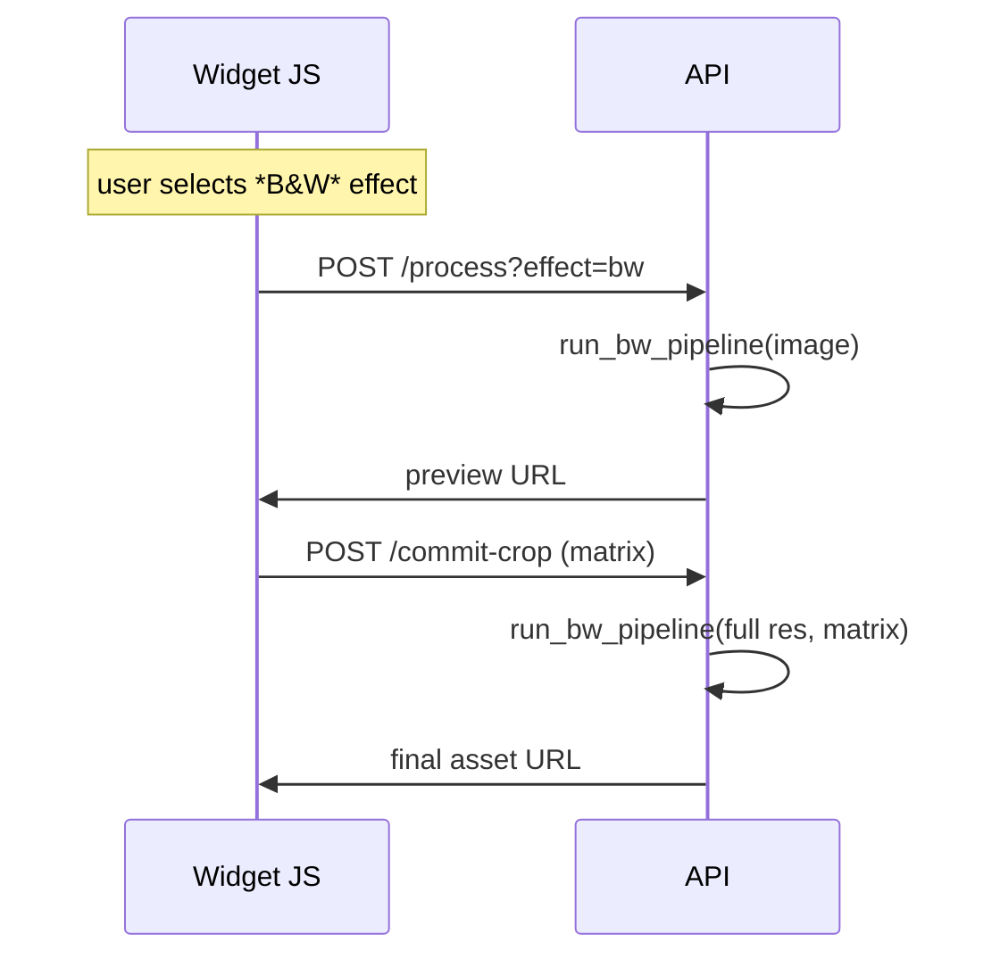

# BW\_PIPELINE\_V2.md

> **Perkie Prints – Black‑and‑White Effect v2.0**\
> *CPU‑only • Highlight‑protected • Ready for Cursor integration*

---

## 1 · Objective

Produce **Tri‑X‑style B&W prints** with clean fur edges, subtle halation, and realistic grain in **< 100 ms** on 1 vCPU Cloud Run while keeping cost ≤ \$0.002 / 1 000 previews.  The pipeline is fully vectorised NumPy/OpenCV and contains **built‑in highlight protection**.

---

## 2 · High‑level processing flow

```mermaid
flowchart TD
    A[Upload RGB<br>1600×1600] --> B[JPEG → float32]
    B --> C[Adaptive Gray<br>(Tri‑X ➜ auto mix)]
    C --> D[CLAHE (8×8, clip 2.0)]
    D --> E[LUT film curve<br>(contrast 1.25, shoulder 0.85)]
    E --> F[Fast Guided Filter<br>radius 4, ε 1e‑3]
    F --> G[Exp ⊕ Gauss halation<br>σ=10, mix 0.6/0.4]
    G --> H[Blue‑noise grain<br>fine+coarse]
    H --> I[PNG‑8 encode]
```

---

## 3 · Request sequence (widget ⇄ API)



---

## 4 · Core implementation (Python snippets)

```python
# bw_pipeline.py
import cv2, numpy as np
from cv2.ximgproc import guidedFilter

# ---- Pre‑built assets (global, cached once) ----
BLUE_NOISE = cv2.imread("assets/blue_noise_256.png", cv2.IMREAD_GRAYSCALE) / 255.0
LUT_PROTECTED = cv2.LUT(
    np.arange(256, dtype=np.uint8),
    # build once using make_lut() below
    cv2.merge([np.uint8(np.linspace(0, 255, 256)) for _ in range(3)])
)

# ---- Helpers ----

def adaptive_gray(img_rgb: np.ndarray) -> np.ndarray:
    """Return luminance channel w/ auto channel mixing in extreme bias cases."""
    tri_x = np.array([0.21, 0.72, 0.07], dtype=np.float32)
    stds = img_rgb.std(axis=(0, 1))
    if stds.ptp() < 0.05:  # flat scene
        combos = np.eye(3, dtype=np.float32)
        idx = np.argmax([((img_rgb @ c).std()) for c in combos])
        weights = combos[idx] / combos[idx].sum()
    else:
        weights = tri_x
    return (img_rgb * weights).sum(axis=2)


def make_lut(contrast=1.25, shoulder=0.85) -> np.ndarray:
    x = np.linspace(0, 1, 256, dtype=np.float32)
    y = np.power(x, 1 / contrast)
    shoulder_mask = y >= shoulder
    y[shoulder_mask] = 1 - (1 - y[shoulder_mask]) * (1 - shoulder)
    return np.clip((y * 255).round(), 0, 255).astype(np.uint8)


# ---- Main pipeline ----

def bw_pipeline(img_bgr: np.ndarray, *, protect_highlights=True, grain=0.25) -> np.ndarray:
    img = cv2.cvtColor(img_bgr, cv2.COLOR_BGR2RGB).astype(np.float32) / 255.0

    gray = adaptive_gray(img)

    clahe = cv2.createCLAHE(clipLimit=2.0, tileGridSize=(8, 8))
    gray = clahe.apply(np.uint8(gray * 255)) / 255.0

    lut = LUT_PROTECTED if protect_highlights else make_lut(shoulder=1.0)
    gray = cv2.LUT(np.uint8(gray * 255), lut).astype(np.float32) / 255.0

    base = guidedFilter(gray, gray, radius=4, eps=1e-3)
    edges = gray - base
    gray = np.clip(gray + edges * 0.15, 0, 1)

    gauss = cv2.GaussianBlur(gray, (21, 21), 7)
    r = np.arange(-10, 11)
    exp_k = np.exp(-np.abs(r) / 10)
    exp_k /= exp_k.sum()
    exp = cv2.sepFilter2D(gray, -1, exp_k, exp_k)
    gray = np.clip(gray + (0.6 * gauss + 0.4 * exp - gray) * 0.1, 0, 1)

    # Grain: tile blue‑noise, scale by strength
    h, w = gray.shape
    tile = np.tile(BLUE_NOISE, (h // 256 + 1, w // 256 + 1))[:h, :w]
    gray = np.clip(gray + (tile - 0.5) * grain, 0, 1)

    return np.uint8(gray * 255)
```

*(Cursor: reuse/adapt existing **`EnhancedBlackWhiteEffect`** class; replace internals with above.)*

---

## 5 · Integration plan (Cursor tasks)

| Step | File                                                | Action                                                                             |
| ---- | --------------------------------------------------- | ---------------------------------------------------------------------------------- |
|  1   | `effects/bw_pipeline_v2.py`                         | **Add** the above module.                                                          |
|  2   | `inspirenet-bg-removal-api/src/effects/__init__.py` | **Register** `'bw_v2'` mapping → `bw_pipeline.bw_pipeline`.                        |
|  3   | `config/settings_schema.json`                       | **Expose** knob `protect_highlights` (bool, default true).                         |
|  4   | `assets/ks-pet-editor.js`                           | **Pass** `protectHighlights` flag from UI.                                         |
|  5   | CI                                                  | **Add** `pytest tests/test_bw_v2.py` with 10 reference fixtures, assert ΔE < 3.    |
|  6   | Terraform/Cloud Run                                 | **No change** (CPU container).                                                     |
|  7   | Monitoring                                          | **Label** Prometheus `effect="bw_v2"`.                                             |
|  8   | Rollout                                             | 5 % traffic flag `effectVersion=bw_v2`; expand to 100 % after p95 < 120 ms / 24 h. |

---

## 6 · Parameters & defaults

| Param               | Range   | Default  | UI control               |
| ------------------- | ------- | -------- | ------------------------ |
| `protectHighlights` | bool    | **true** | Hidden *Advanced* toggle |
| `grainStrength`     | 0 – 1   | 0.25     | Slider                   |
| `edgeBoost`         | 0 – 0.3 | 0.15     | Slider (optional)        |

---

## 7 · Performance budget

| Stage          | Target ms (1600²) |
| -------------- | ----------------- |
| Decode JPEG    | 22                |
| Adaptive Gray  | 4                 |
| CLAHE          | 11                |
| LUT            | 3                 |
| Guided Filter  | 18                |
| Halation blend | 7                 |
| Grain          | 5                 |
| Encode PNG     | 19                |
| **Total**      | **≤ 90 ms**       |

---

## 8 · Future hooks

- Swap `guidedFilter` for **CUDA** version to cut 10–12 ms once OpenCV 5 hits PyPI.
- Drop‑in replace `blue_noise_256.png` with a 512 tile for very large (`> 3000 px`) prints.
- Integrate **tone‑split presets** (classic, matte, infrared) via alternate LUT tables.

---

*End of spec – ready for PR*

