# Advanced Image Processing & Product Customization Platform
## Project Brief v1.0

---

## 🎯 **Project Overview**

### **Vision**
Transform the existing GPU-accelerated background removal service into a comprehensive image processing and product customization platform that allows customers to upload pet photos, apply various artistic effects, and preview them on products before ordering.

### **Goals**
- **Speed**: Process images with all effects in <15 seconds
- **Quality**: Maintain high-quality output (300 DPI for print)
- **Cost**: Minimize processing cost per image while maximizing quality
- **UX**: Seamless integration with existing Shopify store
- **Scalability**: Handle increasing customer demand efficiently

---

## 🏗️ **System Architecture**

### **Current Production Foundation**
```
/inspirenet-bg-removal-api/  ← PRODUCTION SYSTEM (Build Upon This)
├── src/
│   ├── main.py                    ← Current FastAPI service ✅
│   ├── inspirenet_model.py        ← GPU-accelerated InSPyReNet ✅
│   └── storage.py                 ← Cloud Storage integration ✅
├── deploy.yaml                    ← Current Cloud Run GPU deployment ✅
├── requirements.txt               ← Production dependencies ✅
└── Dockerfile                     ← GPU-enabled container ✅

/image-processor/  ← REFERENCE ONLY (Port Effects From This)
├── src/effects implementations    ← Effects to port over
├── test.html                      ← T-shirt mockup example
└── assets/                        ← Reference implementations
```

### **High-Level Architecture**


### **Technology Stack**

#### **Frontend**
- **Primary**: Shopify Liquid (existing store integration)
- **Image Processor**: React Component embedded in Shopify
- **State Management**: React Context + Local Storage
- **UI Library**: Tailwind CSS (consistent with existing design)

#### **Backend Services (Extend Current)**
- **Platform**: Google Cloud Run (GPU-enabled) ✅ **Current**
- **Language**: Python 3.11+ with FastAPI ✅ **Current**
- **Image Processing**: 
  - InSPyReNet (background removal) ✅ **Current - Keep This**
  - OpenCV + Pillow (effects processing) - **NEW - Port from /image-processor/**
  - ImageIO (format optimization) - **NEW**

#### **Database & Storage**
- **Metadata**: Cloud SQL PostgreSQL - **NEW**
- **Image Storage**: Google Cloud Storage ✅ **Current**
- **Cache**: Redis (Cloud Memorystore) - **NEW**
- **Integration**: Shopify GraphQL API ✅ **Current**

#### **DevOps & Monitoring**
- **Deployment**: Cloud Build + Cloud Run ✅ **Current**
- **Monitoring**: Cloud Logging + Cloud Monitoring ✅ **Current**
- **Queue**: Cloud Tasks - **NEW**
- **CDN**: Cloud CDN - **NEW**

---

## 📊 **Database Schema**

### **Core Tables**
```sql
-- Image processing sessions
CREATE TABLE image_sessions (
    id UUID PRIMARY KEY DEFAULT gen_random_uuid(),
    shopify_customer_id VARCHAR(50),
    original_image_url TEXT NOT NULL,
    upload_timestamp TIMESTAMP DEFAULT CURRENT_TIMESTAMP,
    processing_status VARCHAR(20) DEFAULT 'pending',
    session_expires_at TIMESTAMP,
    created_at TIMESTAMP DEFAULT CURRENT_TIMESTAMP,
    updated_at TIMESTAMP DEFAULT CURRENT_TIMESTAMP
);

-- Processed effects for each session
CREATE TABLE processed_effects (
    id UUID PRIMARY KEY DEFAULT gen_random_uuid(),
    session_id UUID REFERENCES image_sessions(id),
    effect_type VARCHAR(50) NOT NULL, -- 'background_removed', 'black_white', 'watercolor', 'pop_art'
    processed_image_url TEXT NOT NULL,
    processing_time_ms INTEGER,
    image_size_bytes INTEGER,
    created_at TIMESTAMP DEFAULT CURRENT_TIMESTAMP
);

-- Customer edits (zoom, rotate, crop)
CREATE TABLE image_edits (
    id UUID PRIMARY KEY DEFAULT gen_random_uuid(),
    session_id UUID REFERENCES image_sessions(id),
    effect_id UUID REFERENCES processed_effects(id),
    zoom_level DECIMAL(5,2) DEFAULT 1.0,
    rotation_degrees INTEGER DEFAULT 0,
    crop_shape VARCHAR(20) DEFAULT 'none', -- 'none', 'circle', 'square'
    crop_x INTEGER DEFAULT 0,
    crop_y INTEGER DEFAULT 0,
    crop_width INTEGER,
    crop_height INTEGER,
    customer_comments TEXT,
    created_at TIMESTAMP DEFAULT CURRENT_TIMESTAMP
);

-- Product mockups
CREATE TABLE product_mockups (
    id UUID PRIMARY KEY DEFAULT gen_random_uuid(),
    session_id UUID REFERENCES image_sessions(id),
    edit_id UUID REFERENCES image_edits(id),
    shopify_product_id VARCHAR(50) NOT NULL,
    mockup_image_url TEXT NOT NULL,
    placement_coordinates JSONB, -- {x, y, width, height, rotation}
    created_at TIMESTAMP DEFAULT CURRENT_TIMESTAMP
);

-- Order associations
CREATE TABLE order_images (
    id UUID PRIMARY KEY DEFAULT gen_random_uuid(),
    session_id UUID REFERENCES image_sessions(id),
    shopify_order_id VARCHAR(50) NOT NULL,
    selected_effect_id UUID REFERENCES processed_effects(id),
    final_edit_id UUID REFERENCES image_edits(id),
    artist_notes TEXT,
    print_status VARCHAR(20) DEFAULT 'pending',
    created_at TIMESTAMP DEFAULT CURRENT_TIMESTAMP
);
```

---

## 🔧 **API Specifications**

### **Current API (Keep These)**
```yaml
GET /health ✅ Current
GET /model-info ✅ Current  
POST /remove-background ✅ Current
POST /warm-up ✅ Current
```

### **New API Endpoints (Extend Current)**

#### **1. Image Upload & Processing**
```yaml
POST /api/v2/images/upload
Content-Type: multipart/form-data
Parameters:
  - file: image file (max 10MB)
  - customer_id: string (optional)
  - session_id: string (optional)
  - effects: array (default: all effects)
Response:
  status: 201
  body:
    session_id: uuid
    processing_status: "processing"
    estimated_completion: timestamp
    webhook_url: string
```

#### **2. Get Processing Status**
```yaml
GET /api/v2/images/{session_id}/status
Response:
  status: 200
  body:
    session_id: uuid
    processing_status: "completed" | "processing" | "failed"
    effects:
      - effect_type: "background_removed"
        image_url: string
        processing_time_ms: integer
      - effect_type: "black_white"
        image_url: string
        processing_time_ms: integer
      - effect_type: "watercolor"
        image_url: string
        processing_time_ms: integer
      - effect_type: "pop_art"
        image_url: string
        processing_time_ms: integer
```

#### **3. Apply Edits**
```yaml
POST /api/v2/images/{session_id}/edit
Content-Type: application/json
Body:
  effect_type: string
  zoom_level: number
  rotation_degrees: integer
  crop_shape: "none" | "circle" | "square"
  crop_coordinates: {x, y, width, height}
  customer_comments: string
Response:
  status: 200
  body:
    edit_id: uuid
    edited_image_url: string
```

#### **4. Generate Product Mockup**
```yaml
POST /api/v2/mockups/generate
Content-Type: application/json
Body:
  session_id: uuid
  edit_id: uuid
  product_id: string
  product_type: string
Response:
  status: 200
  body:
    mockup_id: uuid
    mockup_image_url: string
    placement_info: object
```

---

## 🎨 **Image Processing Pipeline**

### **Processing Workflow**

```mermaid
graph LR
    A[Upload] --> B[Validate & Optimize]
    B --> C[Background Removal<br/>InSPyReNet GPU ✅ Current]
    C --> D[Parallel Effects Processing<br/>Port from /image-processor/]
    
    subgraph "Effects Pipeline (NEW)"
        D --> E1[Black & White<br/>Port from Reference]
        D --> E2[Watercolor<br/>Port from Reference]
        D --> E3[Pop Art<br/>Port from Reference]
        D --> E4[Additional Effects<br/>Port from Reference]
    end
    
    E1 --> F[Store All Effects]
    E2 --> F
    E3 --> F
    E4 --> F
    
    F --> G[Notify Frontend]
    G --> H[User Editing - NEW]
    H --> I[Product Mockup<br/>Based on test.html]
    I --> J[Order Integration ✅ Current]
```


### **Image Quality Standards**
```yaml
Preview/Editing Interface:
  resolution: 1024x1024 max
  format: WebP
  quality: 85%
  size_limit: 500KB

Product Mockups:
  resolution: 1500x1500 max
  format: PNG
  quality: 95%
  size_limit: 2MB

Final Print Files:
  resolution: 300 DPI minimum
  format: PNG/TIFF
  quality: 100%
  color_space: sRGB
  size_limit: 50MB
```

---

## 🖥️ **Frontend Architecture**

### **Component Structure**
```
assets/ks-pet-bg-remover.js ✅ Current (Extend This)
↓
components/
├── ImageProcessor/
│   ├── ImageUpload.jsx (Extend current upload)
│   ├── EffectsSelector.jsx (NEW)
│   ├── ImageEditor.jsx (NEW - zoom, rotate, crop)
│   ├── ProductMockup.jsx (NEW - based on test.html)
│   └── index.jsx
├── UI/
│   ├── ProgressBar.jsx (Enhance current)
│   ├── LoadingSpinner.jsx (Keep current)
│   └── ErrorBoundary.jsx (NEW)
└── Product/
    ├── LightweightPreview.jsx (NEW)
    └── ProductGallery.jsx (NEW)
```

### **State Management**
```javascript
// Extend current window.ksPetBgRemover
const ImageProcessingContext = {
  session: {
    id: string,
    originalImage: File,
    processingStatus: 'pending' | 'processing' | 'completed' | 'failed',
    effects: Array<Effect>, // NEW
    currentEdit: Edit, // NEW
    customerComments: string // NEW
  },
  actions: {
    uploadImage: Function, // ✅ Current
    selectEffect: Function, // NEW
    applyEdit: Function, // NEW
    generateMockup: Function, // NEW
    saveToOrder: Function // NEW
  }
}
```

---

## 🔄 **Shopify Integration**

### **Current Integration (Keep This)**
```yaml
✅ Current Features:
  - Background removal API integration
  - Image upload handling
  - Basic progress tracking
  - Error handling with fallback
```

### **Enhanced Integration (Add This)**
```yaml
NEW Webhook Events:
  - orders/create
  - orders/updated
  - orders/cancelled
  - customers/create

NEW Webhook Handler:
  endpoint: /api/v2/webhooks/shopify
  authentication: HMAC verification
  actions:
    - Link image sessions to orders
    - Update image retention policies
    - Trigger artist workflow
```

### **Product Integration**
```javascript
// NEW: Shopify product metafields for mockup configuration
{
  "mockup_template": "t-shirt-basic.png", // Based on test.html
  "placement_area": {
    "x": 150,
    "y": 200,
    "width": 300,
    "height": 300,
    "max_rotation": 15
  },
  "print_area_dpi": 300
}
```

---

## 📦 **Product Mockup System**

### **Mockup Templates Structure** (Based on test.html)
```
mockups/
├── templates/
│   ├── t-shirts/
│   │   ├── basic-tee-front.png (Port from test.html concept)
│   │   ├── basic-tee-back.png
│   │   └── placement-coordinates.json
│   ├── mugs/
│   │   ├── standard-mug-side.png
│   │   └── placement-coordinates.json
│   ├── frames/
│   │   ├── 8x10-frame.png
│   │   └── placement-coordinates.json
│   ├── hoodies/
│   ├── pillowcases/
│   ├── tote-bags/
│   └── towels/
└── generated/
    └── {session_id}/
        └── {product_id}-mockup.png
```

### **Placement Configuration**
```json
{
  "product_type": "t-shirt",
  "template": "basic-tee-front.png",
  "placement_areas": [
    {
      "name": "center_chest",
      "x": 200,
      "y": 150,
      "width": 250,
      "height": 250,
      "max_image_size": "10in",
      "dpi_requirement": 300,
      "rotation_allowed": true,
      "aspect_ratio_locked": false
    }
  ]
}
```

---

## ⚡ **Performance Optimization**

### **Processing Targets** (Build on Current Performance)
```yaml
Current Performance ✅:
  Background Removal: 3-7 seconds (GPU)
  
NEW Performance Targets:
  Upload to All Effects Complete: <15 seconds
  Individual Effect Switching: <500ms (cached)
  Edit Application: <2 seconds
  Product Mockup Generation: <3 seconds
  Thumbnail Loading: <1 second
```

### **Cost Optimization Strategies**
```yaml
Current ✅:
  - GPU scale-to-zero
  - Cloud Storage caching
  - Optimized timeouts

NEW Additions:
  - Batch processing multiple effects simultaneously
  - Redis cache for frequently accessed images  
  - Automated cleanup (10 days non-orders, 6 months orders)
  - WebP for previews, progressive loading
  - CDN for global content delivery
```

---

## 🗂️ **Storage & Lifecycle Management**

### **Enhanced Storage Structure**
```
gs://perkieprints-processing-cache/ ✅ Current
├── inspirenet-cache/ ✅ Current (Keep This)
├── originals/ (NEW)
│   └── {session_id}/
│       └── original.{ext}
├── processed/ (NEW)
│   └── {session_id}/
│       ├── background_removed.png ✅ Current Output
│       ├── black_white.png (Port from /image-processor/)
│       ├── watercolor.png (Port from /image-processor/)
│       └── pop_art.png (Port from /image-processor/)
├── edited/ (NEW)
│   └── {session_id}/
│       └── {edit_id}.png
├── mockups/ (NEW)
│   └── {session_id}/
│       └── {product_id}-{edit_id}.png
└── final/ (NEW)
    └── {order_id}/
        ├── original.{ext}
        ├── processed.png
        └── artist_notes.txt
```

### **Lifecycle Policies** (Extend Current)
```yaml
Current ✅:
  Cache TTL: 24 hours

NEW Policies:
  Non-Order Images:
    retention: 10 days
    action: delete_all_related_files

  Order Images:
    retention: 6 months
    action: move_to_archive_bucket

  Archive Images:
    retention: 2 years
    action: delete_permanently
```

---

## 👨‍🎨 **Artist Workflow Integration**

### **Artist Dashboard** (Future Phase)
```yaml
Features:
  - Order queue with customer images
  - Side-by-side original and processed view
  - Customer comments and special requests
  - Image editing tools integration
  - Quality approval workflow
  - Print file generation

Access:
  url: /admin/artist-dashboard
  authentication: Shopify admin permissions
  real_time_updates: WebSocket connection
```

---

## 🚀 **Development Phases**

### **Phase 1: Enhanced Processing Engine** (MVP)
**Duration**: 4-6 weeks
**Build Upon**: Current `/inspirenet-bg-removal-api/` system

**Tasks**:
- ✅ Keep current InSPyReNet GPU processing
- 🔄 Port effects from `/image-processor/` to production API
- 🆕 Add editing tools (zoom, rotate, crop, comments)
- 🆕 Basic product mockup generation (based on test.html)
- 🔄 Enhance Shopify order integration

**File Changes**:
```
/inspirenet-bg-removal-api/src/
├── main.py (Extend with new endpoints)
├── inspirenet_model.py ✅ Keep as-is
├── effects_processor.py (NEW - port from reference)
├── image_editor.py (NEW)
└── mockup_generator.py (NEW - based on test.html)
```

**Deliverables**:
- Enhanced API endpoints
- React image processor component
- Basic mockup system
- Database schema implementation

### **Phase 2: Product Integration** 
**Duration**: 3-4 weeks
- Comprehensive product mockup templates
- Lightweight product page previews
- Advanced editing interface
- Performance optimizations

**Deliverables**:
- Complete mockup template library (all product types)
- Product page integration
- Enhanced editing tools
- Performance benchmarks

### **Phase 3: Artist Tools & Analytics**
**Duration**: 2-3 weeks
- Artist dashboard
- Order management integration
- Analytics and reporting
- Advanced customer features

**Deliverables**:
- Artist workflow tools
- Admin dashboard
- Analytics implementation
- Customer feedback system

---

## 📋 **Coding Conventions**

### **Python Backend** (Extend Current Style)
```python
# File naming: snake_case ✅ Current
# Class naming: PascalCase ✅ Current
# Function naming: snake_case ✅ Current
# Constants: UPPER_SNAKE_CASE ✅ Current

# Example extension of current system
class EffectsProcessor:
    """Handles image effects processing building on InSPyReNet foundation."""
    
    def __init__(self, inspirenet_processor: InSPyReNetProcessor):
        """Initialize with existing GPU processor."""
        self.inspirenet = inspirenet_processor  # Build upon current
        
    async def process_with_effects(
        self, 
        image_data: bytes, 
        effects: List[EffectType]
    ) -> ProcessingResult:
        """Process image with multiple effects in parallel.
        
        Args:
            image_data: Raw image bytes
            effects: List of effects to apply
            
        Returns:
            ProcessingResult with all effect outputs
        """
        # First remove background using current system
        bg_removed = await self.inspirenet.remove_background(image_data)
        
        # Then apply additional effects in parallel
        # Port logic from /image-processor/
        pass
```

### **JavaScript Frontend** (Extend Current)
```javascript
// Extend current assets/ks-pet-bg-remover.js
// Keep current naming: camelCase ✅
// Component naming: PascalCase ✅
// Constants: UPPER_SNAKE_CASE ✅

// Example extension
class EnhancedImageProcessor extends window.ksPetBgRemover {
  constructor(options) {
    super(options); // Keep current functionality
    this.effects = []; // NEW
    this.currentEdit = null; // NEW
  }
  
  async processWithEffects(file, effectTypes) {
    // Call current upload first
    const session = await this.uploadImage(file);
    
    // Then process additional effects
    // Implementation here
  }
}
```

### **API Response Format** (Extend Current)
```json
{
  "success": true,
  "data": {
    "session_id": "uuid",
    "processing_time_ms": 12500,
    "background_removed": "url", // ✅ Current
    "effects": [ // NEW
      {
        "type": "watercolor",
        "url": "signed_url",
        "processing_time_ms": 3200
      }
    ]
  },
  "meta": {
    "timestamp": "2024-01-15T10:30:00Z",
    "version": "2.0.0"
  },
  "errors": []
}
```

---

## 📊 **Monitoring & Analytics**

### **Current Metrics** (Keep These)
```yaml
✅ Current Performance Metrics:
  - InSPyReNet processing time
  - GPU utilization percentage
  - Cache hit rates
  - API response times
```

### **New Metrics** (Add These)
```yaml
NEW Performance Metrics:
  - Average processing time per effect
  - Effects processing parallel efficiency
  - Edit application response times
  - Mockup generation times

NEW Business Metrics:
  - Images processed per day
  - Conversion rate (upload to order)
  - Popular effects usage
  - Customer satisfaction scores

NEW Cost Metrics:
  - Processing cost per image (all effects)
  - Storage costs (with lifecycle)
  - GPU utilization costs
  - CDN bandwidth costs
```

### **Enhanced Alerts & Monitoring**
```yaml
Current Alerts ✅:
  - GPU memory usage > 90%
  - Processing time > 20 seconds
  - Error rate > 5%

NEW Alerts:
  - Effects processing time > 15 seconds
  - Edit application time > 5 seconds
  - Mockup generation time > 10 seconds
  - Storage approaching limits
  - Queue depth > 10 items
```

---

## 🔒 **Security & Compliance**

### **Current Security** (Keep This)
```yaml
✅ Current Features:
  - Image upload validation
  - Secure Cloud Storage
  - HTTPS encryption
  - CORS configuration
```

### **Enhanced Security** (Add This)
```yaml
NEW Data Protection:
  - Enhanced image sanitization
  - PII detection in customer comments
  - Secure signed URLs with expiration
  - Input validation for all effects

NEW Access Control:
  - Session-based image access
  - Customer data isolation
  - Artist dashboard authentication
  - Admin role permissions
```

---

## 💰 **Cost Estimation**

### **Current Costs** ✅
```yaml
Background Removal (1000 images/month): ~$5
Storage: ~$2
Total Current: ~$7/month
```

### **Enhanced System Projections**
```yaml
Monthly Operating Costs (1000 images/month):
  GPU Processing (all effects): ~$15-20
  Storage (with lifecycle): ~$5-8
  Database: ~$10-15
  CDN & Bandwidth: ~$5-10
  Monitoring & Logging: ~$2-5

Total Estimated: $37-58/month
Cost per image: $0.037-0.058

Scaling Projections (10,000 images/month):
  GPU Processing: ~$120-150
  Storage: ~$25-35
  Database: ~$30-40
  CDN & Bandwidth: ~$15-25
  Monitoring: ~$10-15

Total Estimated: $200-265/month
Cost per image: $0.020-0.027
```

---

## 🎯 **Success Criteria**

### **Technical KPIs**
- [ ] Processing time < 15 seconds (all effects)
- [ ] 99.9% uptime (maintain current reliability)
- [ ] < 2% error rate
- [ ] Cost per image < $0.05
- [ ] Keep current GPU performance advantages

### **Business KPIs**
- [ ] Increased conversion rate from image uploads
- [ ] Reduced artist workload
- [ ] Improved customer satisfaction
- [ ] Faster order fulfillment
- [ ] Support for all product types (t-shirts, mugs, frames, etc.)

### **User Experience KPIs**
- [ ] < 3 clicks to process and order
- [ ] < 500ms for effect switching (cached)
- [ ] Intuitive editing interface
- [ ] Mobile-responsive design
- [ ] Seamless Shopify integration

---

## 📞 **Next Steps**

### **Immediate Actions**
1. **Review and approve** this project brief
2. **Set up development environment** for Phase 1
3. **Analyze `/image-processor/` effects** for porting strategy
4. **Create detailed technical specifications** for MVP features
5. **Establish testing protocols** for image quality and performance

### **Phase 1 Kickoff**
1. **Extend current API** (`/inspirenet-bg-removal-api/src/main.py`)
2. **Port effects logic** from `/image-processor/` reference
3. **Implement database schema** for session management
4. **Create React components** for enhanced UI
5. **Test integration** with current Shopify setup

---

## 🔄 **Migration Strategy**

### **Zero-Downtime Approach**
```yaml
Current System ✅:
  - Keep /remove-background endpoint active
  - Maintain current GPU performance
  - Preserve existing integrations

NEW System (Parallel):
  - Add /api/v2/ endpoints
  - Implement effects processing
  - Test with current customers

Transition:
  - A/B test new features
  - Gradual rollout
  - Fallback to current system if needed
```

---

*This project builds upon the successful GPU-accelerated InSPyReNet background removal system in `/inspirenet-bg-removal-api/` and extends it into a comprehensive image processing and product customization platform, using `/image-processor/` as reference for effects implementation.* 